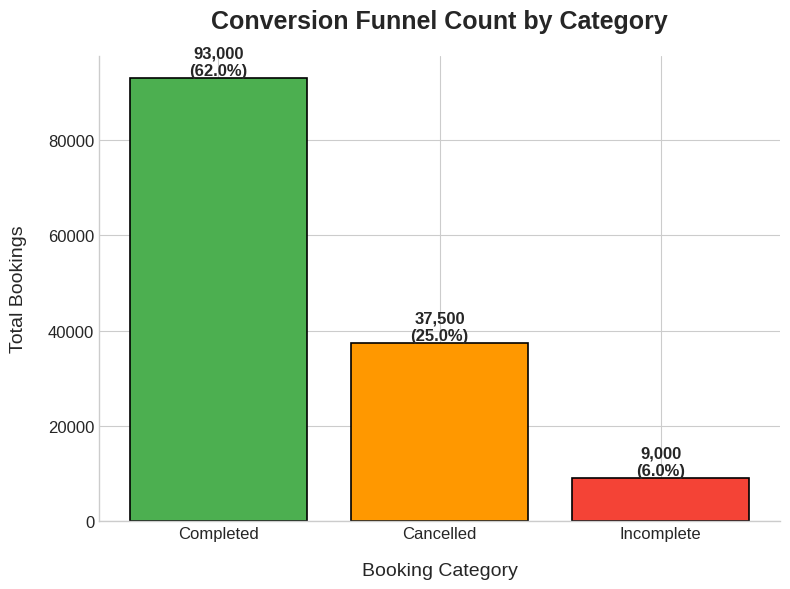

# 🚕 Uber ride data deep-dive (data untuk tahun 2024) deep-dive

Data set ini mencakup total 148.767K pemesanan di berbagai jenis kendaraan dan memberikan gambaran lengkap tentang operasi berbagi tumpangan, termasuk perjalanan yang berhasil, pembatalan, perilaku pelanggan, dan metrik keuangan.

# Overview

**End-to-end analisis dengan bisnis storytelling.**
Kita akan meng-eksplor mulai dari demand, cancel, rating driver dan customer, revenue, dan operation. **Note:** Semua chart di jelaskan dengan **Bahasa Indonesia**

## 📋 Data Schema

| Nama Kolom                            | Deskripsi                                                                               |
| ------------------------------------- | --------------------------------------------------------------------------------------- |
| **Date**                              | Tanggal pemesanan perjalanan.                                                           |
| **Time**                              | Waktu pemesanan perjalanan.                                                             |
| **Booking ID**                        | Pengenal unik untuk setiap pemesanan.                                                   |
| **Booking Status**                    | Status pemesanan, seperti _Completed, Cancelled by Customer, Cancelled by Driver_, dll. |
| **Customer ID**                       | Pengenal unik untuk setiap pelanggan.                                                   |
| **Vehicle Type**                      | Jenis kendaraan yang digunakan (_Go Mini, Go Sedan, eBike/Bike, UberXL_, dll.).         |
| **Pickup Location**                   | Lokasi awal/penjemputan perjalanan.                                                     |
| **Drop Location**                     | Lokasi tujuan/pengantaran perjalanan.                                                   |
| **Avg VTAT**                          | Rata-rata waktu kedatangan kendaraan.                                                   |
| **Avg CTAT**                          | Rata-rata waktu kedatangan pelanggan.                                                   |
| **Cancelled Rides by Customer**       | Indikator (flag) untuk pemesanan yang dibatalkan oleh pelanggan.                        |
| **Reason for cancelling by Customer** | Alasan spesifik pembatalan yang dilakukan oleh pelanggan.                               |
| **Cancelled Rides by Driver**         | Indikator (flag) untuk pemesanan yang dibatalkan oleh pengemudi.                        |
| **Driver Cancellation Reason**        | Alasan spesifik pembatalan yang dilakukan oleh pengemudi.                               |
| **Incomplete Rides**                  | Indikator (flag) untuk pemesanan yang tidak selesai.                                    |
| **Incomplete Rides Reason**           | Alasan spesifik mengapa pemesanan tidak selesai.                                        |
| **Booking Value**                     | Total nilai atau biaya dari perjalanan.                                                 |
| **Ride Distance**                     | Jarak yang ditempuh selama perjalanan (dalam kilometer).                                |
| **Driver Ratings**                    | Rating yang diberikan kepada pengemudi (skala 1–5).                                     |
| **Customer Rating**                   | Rating yang diberikan oleh pelanggan (skala 1–5).                                       |
| **Payment Method**                    | Metode pembayaran yang digunakan (_UPI, Cash, Credit Card, Uber Wallet, Debit Card_).   |

# 📊 Analisis KPI dan Conversion Funnel

## 🔑 Ringkasan Utama: KPI dan Conversion Funnel--**key insight**

1. **Pendapatan Total:** Rp51.846.384 dengan jarak tempuh rata-rata 24,64 km.
2. **Tipe Kendaraan:** Ada 7 jenis kendaraan untuk kategorinya ada Auto, Go Mini, Go Sedan, Bike, E-bike, Premier Sedan dan yg terakhir itu ada Uber XL.
3. **Total Pesanan:** 148.767 total perjalanan.
4. **Jumlah Pelanggan:** Total pelanggan yang menggunakan Uber sepanjang tahun 2024 mencapai 150.000 pengguna.
5. **Tingkat Keberhasilan:** Tingkat keberhasilan perjalanan Uber di tahun 2024 adalah 62% dari total 93.000 perjalanan.
6. **Pembatalan Perjalanan:** Total frekuensi pembatalan adalah 37.500, yang terbagi menjadi:

   - _Pembatalan oleh pengemudi:_ 27.500 perjalanan (18%).
   - _Pembatalan oleh pelanggan:_ 10.500 perjalanan (7%).

   Kesimpulan poin : Pembatalan oleh pengemudi jauh lebih tinggi (18%) dibandingkan oleh pelanggan (7%). Meskipun frekuensi pembatalan dari kedua sisi sama-sama besar, perilaku pengemudi perlu dievaluasi dan menjadi perhatian utama.

7. **Perjalanan Tidak Selesai:** Perjalanan yang tidak selesai mencapai 6% dari sekitar 9.000 pesanan. Hal ini menyebabkan kerugian sumber daya dan pendapatan.
8. **Ratings Gap**: driver ratings (4.23) < customer rating (4.40), memungkinkan untuk lebih memaksimalkan layanan pengemudi kendaraan uber.

## 🎈 Conversion Funnel

## 

#### 📈 Conversion Funnel Insight

- Dari total 148.767 pesanan/order, jumlah perjalanan yang berhasil diselesaikan menurun drastis menjadi 93.000 atau sekitar 62%. Ini menunjukkan penurunan signifikan sekitar 38% dari total pesanan/order awal.
- Pesanan yang dibatalkan mencapai 25%, dengan pembatalan oleh driver menjadi yang tertinggi yaitu sebesar 18% atau sekitar 27.500 pesanan.
- Pesanan yang tidak terselesaikan mencapai 6%, yang kemungkinan disebabkan oleh faktor operasional seperti kendala rute, gangguan aplikasi, atau insiden di lapangan. Hal ini perlu ditangani melalui jalur mitigasi khusus.

## 🚖 Vehicle Performance KPI

| Tipe Kendaraan | Total Pemesanan | Completed | Booking Revenue | Avg. Distance (km) | Total Distance Covered (km) | Avg. Driver Ratings | Avg. Customer Ratings | Success Rate (%) |
| -------------- | --------------- | --------- | --------------- | ------------------ | --------------------------- | ------------------- | --------------------- | ---------------- |
| Auto           | 37,419          | 23,128    | 12,878,422      | 24.62              | 625,616                     | 4.23                | 4.40                  | 61.88            |
| Go Mini        | 29,806          | 18,529    | 10,338,496      | 24.61              | 501,201                     | 4.23                | 4.40                  | 62.23            |
| Go Sedan       | 27,141          | 16,666    | 9,369,719       | 24.61              | 450,794                     | 4.23                | 4.41                  | 61.44            |
| Bike           | 22,517          | 14,026    | 7,837,697       | 24.65              | 378,666                     | 4.23                | 4.40                  | 62.33            |
| Premier Sedan  | 18,111          | 11,247    | 6,275,332       | 24.60              | 302,936                     | 4.23                | 4.40                  | 62.13            |
| eBike          | 10,557          | 6,547     | 3,618,485       | 24.99              | 179,456                     | 4.23                | 4.40                  | 62.05            |
| Uber XL        | 4,449           | 2,783     | 1,528,032       | 24.40              | 74,307                      | 4.24                | 4.40                  | 62.55            |

### 🚗 Insight untuk performa jenis kendaraan

- **Yang paling banyak di pesan:** _Auto_ dengan total (**37,419 perjalanan**) dan memiliki revenue sebesar Rp.12.878.422 dengan tingkat keberhasilan mencapai 61.88%.
- Dari sekian banyak jenis kendaraan yang ditawarkan Uber XL memiliki success rate tertinggi dengan total sebesar 62.55%.
- **Ratings Gap:** perbedaan rating antara pelanggan dan pengemudi relatif kecil, dengan rata-rata rating pengemudi di sekitar 4,23 dan pelanggan 4,40, keduanya konsisten di atas 4,00.

---

## 

_Uber XL mencatat tingkat keberhasilan (success rate) terbaik sebesar 62,55% dari total 4.449 pesanan, dengan 2.783 pesanan berhasil diselesaikan. Sementara itu, di posisi terendah terdapat Go Sedan dengan tingkat keberhasilan hanya 61,44% dari 27.141 pesanan, di mana 16.666 di antaranya berhasil diselesaikan._

# 👨 Customer and 👨‍✈️ Driver ratings distribution

### 1. 👨 Customer ratings distribution

- Urut berdasarkan customer rating dari yg terendah ke yang tertinggi range rating (3⭐- 5⭐)
- Hitung seluruh customer rating per rating yg diberikan customer

---

## 

**Key Findings:**

- Mayoritas rating pelanggan berada di kisaran 4.1 hingga 4.9. Ini menunjukkan bahwa sebagian besar pelanggan memiliki pengalaman yang sangat positif atau puas dengan layanan.
- Rata-rata ratings yang diberikan customer berada di kisaran rating 4.40 berdasarkan table yg ada di vehicle performace KPI table.
- Sebaran untuk rating dibawah 4.0 relatif cukup keci, mengindikasikan bahwa penglaman yang buruk jarang terjadi. Namun, adanya customer yg tetap memberikan rating rendah ini terutama di rating 3.6 - 3.9 perlu di perhatikan.

**Business Insight:**

1.  Sebagian besar customer memberikan rating yang tinggi, ini berarti untuk layanan keseluruhan memenuhi atau bahkan melampaui ekspektasi.
2.  Adanya indikator ketidak puasan terhadap layanan dan berpotensi untuk tidak menggunakan Uber lagi, ini dapat menjadi indikasi resiko churn untuk customer yg memberikan rating di bawah 4.0.

### 👨‍✈️ Driver ratings distribution

- Urut berdasarkan driver ratings dari yg terendah ke yang tertinggi diman range rating berada pada (3⭐- 5⭐).
- Hitung driver ratings untuk melihat distribution rating yang diberikan customer terhadap driver

---

## 

**Key Findings:**

- Mayoritas rating untuk pengemudi berada dikisaran 4.0-4.9, (mengindikasikan sebagian besar pengemudi secara konsisten memberikan layanan yang memuaskan).
- Rata-rata rating yang diberikan customer berada di range 4.2-4.3, menjadikan kisaran rating tersebut yang paling umum diberikan oleh customer.

**Business Insight:**

- Distribusi rating diatas 4.0 merupakan sinyal positif untuk model bisnis uber dalam menjaga kualitas layanan.
- Sebaran rating dibawah 4.0 dapat menjadi indikator untuk driver yang berisiko, pada kategori ini uber dapat mengidentifikasi masalah seperti perilaku driver, kondisi kendaraan, atau efesiensi rute yng dapat mencegah driver keluar dari platform (driver churn), yang dapat berdampak buruk untuk pengalaman pelanggan.

# Customer Segmentation Analysis

- Kategorikan customer berdasarkan total lifetime value (ltv.)
- Berikan rank value untuk tingkat customer mulai dari low-high value segments.
- Hitung key metrict: total revenu

